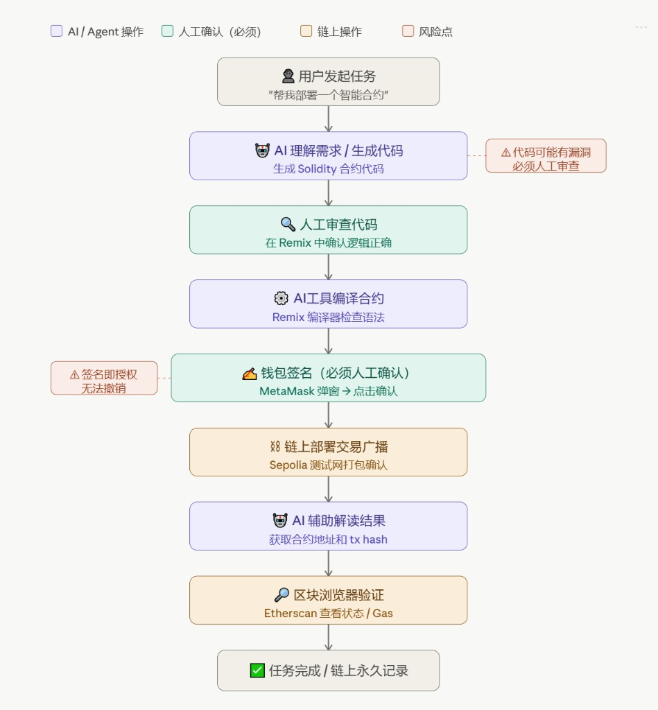

# Week 1｜AI × Web3 最小交叉流程图 — 提交说明

> 任务：画出最小 AI × Web3 工作流，标明发起方、执行方、人工确认、验证与风险。  
> **无**私钥、助记词、API Key。

---

## 流程图（图片）

（若 GitHub 上图片未显示，可刷新或点开同目录 `week1-ai-web3-cross-flow.png` 原始文件。）

**图中要素（与任务要求对照）**

| 要求 | 图中体现 |
|------|-----------|
| 谁发起 | 用户发起任务（「帮我部署一个智能合约」） |
| 谁执行 | AI/Agent：生成代码、编译辅助、解读结果；链上：部署广播、浏览器可查 |
| 钱包签名 / 授权 | **钱包签名**步骤（MetaMask 确认部署交易） |
| 必须人工确认 | **人工审查代码**；**钱包签名（必须人工确认）** |
| 如何验证 | **区块浏览器验证**（Etherscan 看状态、Gas、合约地址） |
| 风险点 | **代码可能有漏洞，须人工审查**；**签名即授权、不可撤销** |

---

## 提交说明（3～5 句话）

1. **解决什么问题**：如何在 **AI 辅助**下完成 **测试网合约部署** 一类链上任务，同时让 **关键控制权**（代码正确性、签名）仍在 **人工** 手中，而不是全盘交给模型。  
2. **哪些由 AI / Agent 辅助**：理解需求、**生成 Solidity**、在流程中辅助 **编译/语法检查**、以及链上结果出来后的 **地址与 Tx 解读**。  
3. **哪些必须人工确认**：至少在 **Remix 中审查 AI 生成的代码逻辑**；以及 **MetaMask 弹窗中对部署交易的确认**（网络、合约创建、Gas）。  
4. **如何验证最终结果**：在 **Etherscan（Sepolia）** 查看 **交易状态**、**Gas**、**合约地址** 是否与预期一致，并与 Remix / 本地记录交叉核对。  
5. **主要风险点**：AI 生成代码可能有 **漏洞或错误**，必须通过 **人工审查**；链上 **签名一旦确认即不可随意撤销**，须 **谨慎核对** 再点确认。

---

## 自评（提交对照）

| 指引项 | 完成 |
|--------|------|
| 流程图链接或图片 | ✅ 同上 PNG |
| 3～5 句说明（问题 / AI / 人工 / 验证 / 风险） | ✅ 本节 |
| 无敏感信息 | ✅ |
